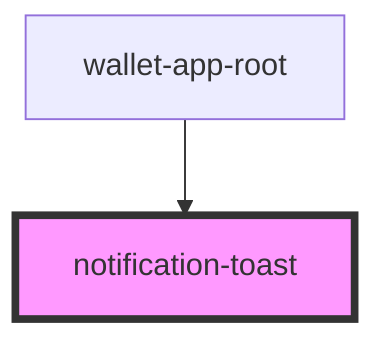

# notification-toast

## Properties

| Property   | Attribute  | Description | Type                   | Default     |
| ---------- | ---------- | ----------- | ---------------------- | ----------- |
| `duration` | `duration` |             | `number`               | `3000`      |
| `message`  | `message`  |             | `string`               | `''`        |
| `type`     | `type`     |             | `"error" \| "success"` | `'success'` |

## Dependencies

### Used by

 - [wallet-app-root](../wallet-app-root)

### Graph

----------------------------------------------

*Built with [StencilJS](https://stenciljs.com/)*
