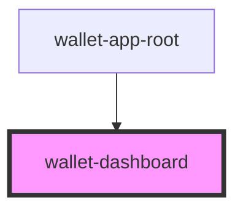

# wallet-dashboard

## Properties

| Property   | Attribute   | Description | Type     | Default     |
| ---------- | ----------- | ----------- | -------- | ----------- |
| `walletId` | `wallet-id` |             | `string` | `undefined` |

## Events

| Event                | Description | Type                                                            |
| -------------------- | ----------- | --------------------------------------------------------------- |
| `notificationChange` |             | `CustomEvent<{ message: string; type: "error" \| "success"; }>` |
| `showTransactions`   |             | `CustomEvent<void>`                                             |

## Dependencies

### Used by

 - [wallet-app-root](../wallet-app-root)

### Graph

----------------------------------------------

*Built with [StencilJS](https://stenciljs.com/)*
