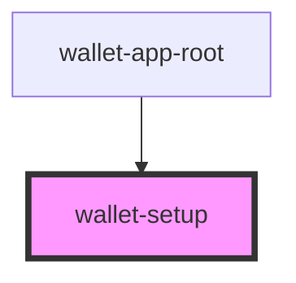

# wallet-setup

## Events

| Event                | Description | Type                                                            |
| -------------------- | ----------- | --------------------------------------------------------------- |
| `notificationChange` |             | `CustomEvent<{ message: string; type: "error" \| "success"; }>` |
| `walletCreated`      |             | `CustomEvent<{ walletId: string; }>`                            |

## Dependencies

### Used by

 - [wallet-app-root](../wallet-app-root)

### Graph

----------------------------------------------

*Built with [StencilJS](https://stenciljs.com/)*
