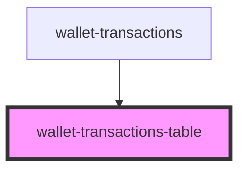

# wallet-transactions-table

## Properties

| Property   | Attribute   | Description | Type     | Default     |
| ---------- | ----------- | ----------- | -------- | ----------- |
| `walletId` | `wallet-id` |             | `string` | `undefined` |

## Dependencies

### Used by

 - [wallet-transactions](../wallet-transactions)

### Graph

----------------------------------------------

*Built with [StencilJS](https://stenciljs.com/)*
