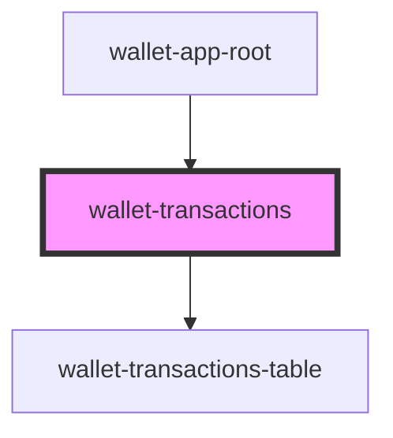

# wallet-transactions

## Properties

| Property     | Attribute      | Description | Type     | Default                   |
| ------------ | -------------- | ----------- | -------- | ------------------------- |
| `apiBaseUrl` | `api-base-url` |             | `string` | `'http://localhost:3001'` |
| `walletId`   | `wallet-id`    |             | `string` | `undefined`               |

## Events

| Event                | Description | Type                                                            |
| -------------------- | ----------- | --------------------------------------------------------------- |
| `back`               |             | `CustomEvent<void>`                                             |
| `notificationChange` |             | `CustomEvent<{ message: string; type: "error" \| "success"; }>` |

## Dependencies

### Used by

 - [wallet-app-root](../wallet-app-root)

### Depends on

- [wallet-transactions-table](../wallet-transactions-table)

### Graph

----------------------------------------------

*Built with [StencilJS](https://stenciljs.com/)*
